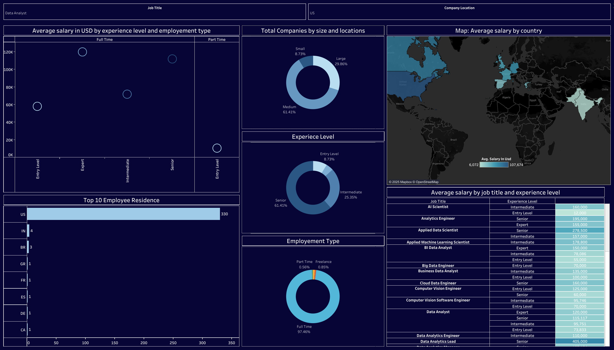

# 🌟 **Data Science Jobs Salaries Dashboard (Tableau)**

🔗 **Live Dashboard:**
👉 **View on Tableau Public:**
[https://public.tableau.com/views/Portfolio_project_1DataScienceJobssalariesdashboard/Dashboard1?:language=en-US&:sid=&:redirect=auth&:display_count=n&:origin=viz_share_link](https://public.tableau.com/views/Portfolio_project_1DataScienceJobssalariesdashboard/Dashboard1?:language=en-US&:sid=&:redirect=auth&:display_count=n&:origin=viz_share_link)

---

## 🖼️ **Dashboard Preview**



---

## 📘 **Overview**

This project features a comprehensive **Tableau dashboard** analyzing **Data Science & Analytics industry salaries** across different roles, countries, company sizes, experience levels, and employment types.

Using the *Data Science Job Salaries* dataset, the dashboard reveals global salary trends and compensation insights, helping users understand how data-related jobs vary across the world.

---

## ✨ **Key Features of the Dashboard**

### 📌 **1. Average Salary by Experience Level & Employment Type**

* Compare full-time, part-time, freelance roles
* Salary trends for entry, mid-level, senior & expert roles

### 📌 **2. Total Companies by Size & Location**

* Breakdown of small, medium, and large companies
* Understand which organizations dominate the data job market

### 📌 **3. Average Salary by Country (World Map)**

* Global salary distribution
* Identify high and low-paying regions

### 📌 **4. Top 10 Employee Residences**

* Countries with the most professionals in the dataset

### 📌 **5. Experience Level Distribution**

* Percentage share of workforce across experience tiers

### 📌 **6. Employment Type Distribution**

* Full-time, part-time, contracting, freelance

### 📌 **7. Salary by Job Title & Experience Level**

Covers roles such as:

* Data Analyst
* Data Scientist
* Machine Learning Engineer
* AI Scientist
* BI Analyst
* Data Engineer
* And more…

---

## 📂 **Project Files Included**

```
📄 Portfolio_project_1 Data Science Jobs salaries dashboard.twb  
📄 ds_salaries.csv  
🖼️ Dashboard 1.png
```

---

## 🛠️ **Tools & Technologies**

* Tableau Desktop / Tableau Public
* Excel / CSV Data Source
* (Optional) Python & Pandas for preprocessing
* Visualizations: Geo Maps, Donut Charts, Bar Charts, Scatter Plots

---

## 🚀 **Insights & Observations**

* Senior-level professionals earn the **highest salaries globally**
* Full-time employment makes up **97%+** of the dataset
* The **United States** has the highest concentration of data professionals
* **Medium-sized companies** provide the most job opportunities
* Wide salary variations exist across countries and roles

---

## 📈 **How to Explore the Dashboard**

1. Open the Tableau Public link
2. Use filters to explore:

   * Job Title
   * Employment Type
   * Country
   * Experience Level
3. Hover over visuals for tooltips & deeper insights

---

## 💡 **Future Enhancements**

* Add forecast models for future salary trends
* Integrate live salary datasets
* Build interactive multi-page Tableau storyboards

---

## 🤝 **Connect**

Feel free to collaborate, contribute ideas, or reach out for improvements.

